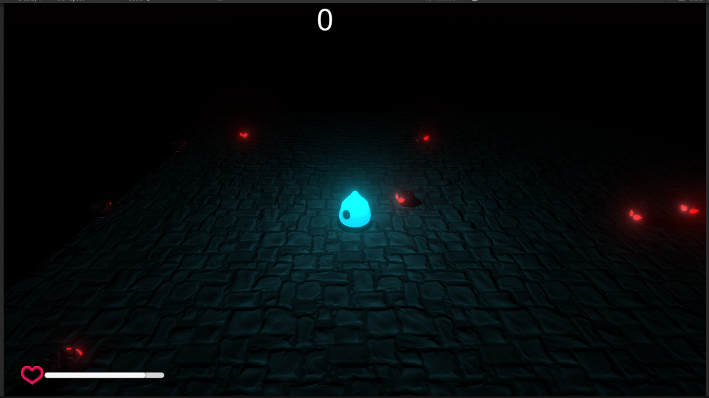

# TPSFinal

A small game jam top-down shooter made in Unity.

You play as a glowing blue fighter dropped into a dark arena while red-eyed enemies close in from the shadows. The goal is simple: keep moving, keep shooting, and survive long enough to stack up a score.



## What This Project Is

This repo contains the full Unity project for a compact arcade-style shooter with:

- top-down movement
- mouse aiming
- rapid shooting
- enemy pursuit and contact damage
- health and score UI
- wave/spawn-based pressure
- a moody, high-contrast arena look

It has that classic game jam energy: fast to understand, easy to jump into, and focused on one clean combat loop.

## Gameplay Feel

The whole vibe of the game is built around readability and pressure:

- the player glows bright blue so you always stand out
- enemies are dark shapes with sharp red highlights
- the arena is intentionally dim, which makes movement and danger pop
- the HUD stays simple so the action remains the focus

## Controls

Based on the current scripts in the project:

- `WASD`: move
- Mouse: aim
- Left mouse button / `Fire1`: shoot
- `Escape`: pause

There are also a few experimental scripts in the repo for alternate movement ideas like teleporting or dashing, but the main playable setup is the standard top-down shooter control scheme above.

## Main Scene

The project includes:

- `Assets/Scenes/FinalScene.unity`
- `Assets/Scenes/SampleScene.unity`

`FinalScene` appears to be the main gameplay scene.

Note: `ProjectSettings/EditorBuildSettings.asset` is currently empty, so if you want to make a build you may need to add the scene to Unity Build Settings first.

## Core Systems

### Player

- `Assets/PlayerScripts/PlayerMovement.cs`
  - movement with input axes
  - rotates the player toward the mouse cursor
- `Assets/PlayerScripts/PlayerShooting.cs`
  - handles fire rate, muzzle effects, line rendering, raycast hits, and enemy damage
- `Assets/PlayerScripts/PlayerHealth.cs`
  - handles player health, damage flash, death state, and disabling controls on death

### Enemies

- `Assets/EnemyScripts/EnemyMovement.cs`
  - uses `NavMeshAgent` to chase the player and wander
- `Assets/EnemyScripts/EnemyAttack.cs`
  - deals damage when enemies reach the player
- `Assets/EnemyScripts/EnemyHealth.cs`
  - takes damage, plays hit/death feedback, and awards score on kill

### Game Flow

- `Assets/ManagingScripts/ScoreManager.cs`
  - updates the score UI
- `Assets/ManagingScripts/EnemyManager.cs`
  - spawns enemies from set spawn points
- `Assets/PlayerScripts/EnemyWaves.cs`
  - contains an alternate wave/timer spawn setup
- `Assets/ManagingScripts/PauseManager.cs`
  - handles pause toggling and audio snapshot changes

## Project Structure

```text
Assets/
  CameraScripts/      Camera logic
  EnemyScripts/       Enemy AI, attack, health, spawning
  ManagingScripts/    Score, pause, pooling, shared managers
  PlayerScripts/      Player movement, shooting, health, utility scripts
  Particles/          Gunfire and hit particle prefabs
  Prefabs/            Gameplay prefabs
  Scenes/             Main Unity scenes
  Materials/          Character and environment materials
  Models/             Character models
  Texture/            UI and sprite textures
```

## Tech Notes

- Unity version: `2022.3.62f2`
- Notable packages:
  - `com.unity.ai.navigation`
  - `com.unity.postprocessing`
  - `com.unity.textmeshpro`
  - `com.unity.ugui`

## How To Open

1. Open the project in Unity `2022.3.62f2` or another close `2022.3` release.
2. Open `Assets/Scenes/FinalScene.unity`.
3. Add the scene to Build Settings if needed.
4. Press Play.

## Notes For Anyone Browsing The Repo

- This is a small, focused game jam project rather than a large production game.
- Some scripts show iteration and experimentation, especially around spawning and alternate movement ideas.
- The strongest part of the project is the clean arcade loop mixed with the dark glowing presentation.

## Summary

`TPSFinal` is a compact top-down shooter prototype with a simple hook: survive the arena, blast enemies, and chase a higher score. If you like small arcade games with a moody look and direct action, that is exactly what this project is going for.
